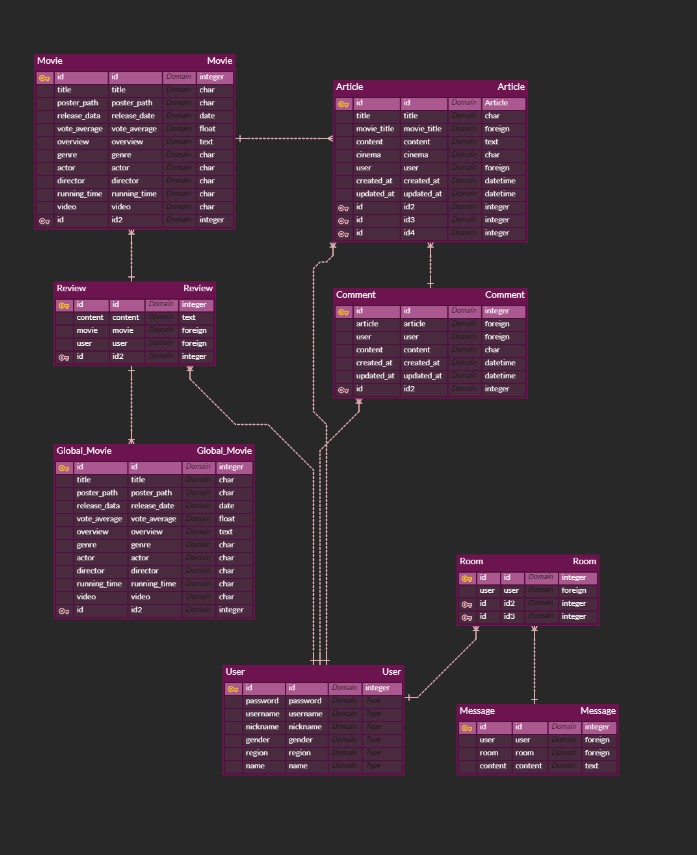

# 최종 프로젝트

## 팀명: POP.GG

### 팀원 소개

- 팀장 : 이유영 - 백엔드(Django), 프론트엔드(vue)
- 팀원 : 장근우 - 프론트엔드(vue)

### 목표 서비스 구현 및 실제 구현 정도

- 현재 상영중인 영화를 보여주고, 그중 한국 박스오피스 10위내의 자료를 순위대로 추천해줌
- 영화를 같이 볼 사람을 구하는 커뮤니티, 당근마켓처럼 커뮤니티에 글을 쓰면 그 글을 타고 작성자와 1대1 채팅이 가능하도록 함

- 현재 상영중인 영화는 TMDB에서 현재 상영중인 영화 API를 받아서 인기도 순으로 보여주고, 영화를 같이 볼 사람을 구하는 커뮤니티의 맨위에 박스오피스 순위를 보여줌
- 회원가입, 로그인, 로그아웃, 로그인 해야만 기능들 사용 가능, 영화 상세정보창에서 댓글 기능, 커뮤니티에 글쓰기, 댓글 기능, 커뮤니티에서 지역에 따른 글 필터링, 글을 통해 작성자와의 채팅 바로가기, 선택한 영화관으로 예매 바로가기 링크, 현재 채팅중인 상대를 확인할수 있는 목록, 목록을 통해 채팅창 들어가기 등의 기능을 구현
- 채팅을 하면 DB에 저장, 2초마다 창을 새로고침 해주어 채팅창을 구현한 방식
- 디자인 등 보여지는 부분이 좀 아쉽긴 하지만 핵심적인 기능은 모두 구현
- 모든 데이터들이 Django DB에 저장되다보니 너무 많은 채팅, 영화를 불러올때 시간이 좀 걸림

### 데이터베이스 모델링(ERD)

### 영화 추천 알고리즘

- 현재 한국에서 상영중인 영화 중 박스오피스 top10을 추천해줌

### 서비스 대표 기능

- 영화를 같이 볼 사람이 없을 때 같이 볼 사람을 찾는 커뮤니티, 작성자와의 1대1 채팅 기능

### 배포

- 서버는 배포하였으나 배포하기 위해서는 도메인주소를 구매해야해서 하지 않음

### 느낀점 및 후기

- 채팅을 구현할 때 웹소켓을 이용해 구현하려 했으나 실패하여 Django DB에 저장하여 보여주는 방식으로 구현한 부분이 아쉬웠다.
- 둘이 프로젝트를 진행하면서 master브랜치에서 작업을 하고, 깃에 올려 conflict가 발생하는 등의 실수가 몇번 있었어서 더 큰 프로젝트를 진행할 때는 더 조심해야겠다는 생각이 들었다.
- 프로젝트를 진행하면서 Django와 Vue 모두 부족하다는 생각이 들었고, 좀더 공부해야겠다는 생각을 했다. 다른 친구들의 도움도 받아가면서 진행하여 고마움을 느꼈다.
- 팀원과 의견충돌도 없었고 별탈없이 프로젝트를 마무리할 수 있어 다행이라 생각했다.
